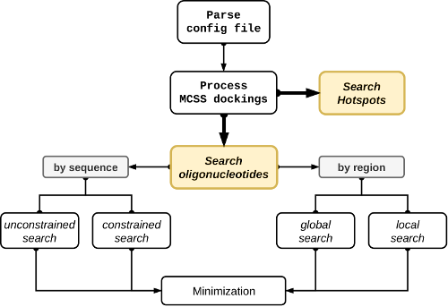

# NUCLEAR

The NUCLEotide AssembleR (NUCLEAR) is a graph-inspired solution for the *in-silico* fragment-based design of oligonucleotides. NUCLEAR fragments can be any standard or modified mono-nucleotide configuration parsed from the output of the MCSS docking software. NUCLEAR can also generate molecular hotspots by clustering the nucleotide MCSS docking results in sets of 'popular' regions of the receptor surface. All the necessary parameters to run the program can be specified by the user through a configuration file.



In a single job, users can request one of two exclusive explorations: either **(i)** a molecular hotspots search (to gain insights into the most accessible regions of the receptor) or **(ii)** an oligonucleotide search (to find geometrically linkable nucleotides that best interact with a receptor macromolecule). In the former case, a local or global receptor region can be defined, while the oligo-nucleotide sequence can be optionally specified in the latter.


```{toctree}
:maxdepth: 2
:hidden:

Installation <installation>
Parameters <parameters>
Help & Contributions <contributing>
License <license>
Changelog <changelog>
Authors <authors>

```
